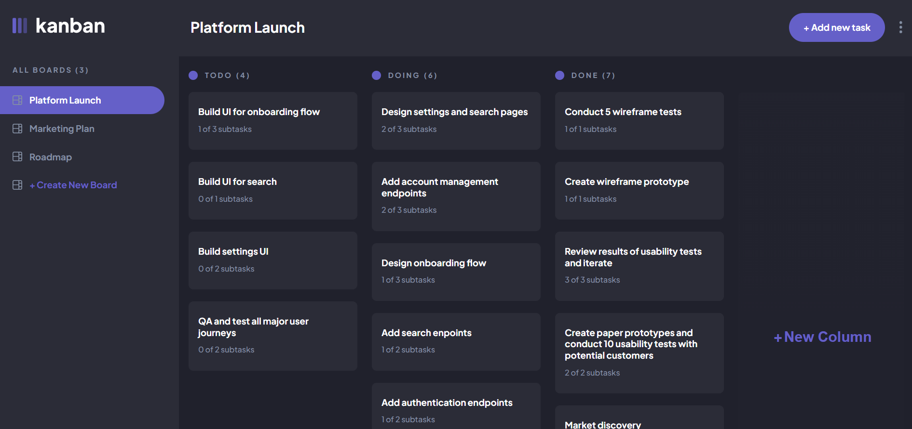

# Frontend Mentor - Kanban task management web app solution

This is a solution to the [Kanban task management web app challenge on Frontend Mentor](https://www.frontendmentor.io/challenges/kanban-task-management-web-app-wgQLt-HlbB). Frontend Mentor challenges help you improve your coding skills by building realistic projects.

## Table of contents

- [Overview](#overview)
  - [The challenge](#the-challenge)
  - [Screenshot](#screenshot)
  - [Links](#links)
- [My process](#my-process)
  - [Built with](#built-with)
  - [What I learned](#what-i-learned)
  - [Continued development](#continued-development)
  - [Useful resources](#useful-resources)
- [Author](#author)


## Overview

### The challenge

Users should be able to:

- View the optimal layout for the app depending on their device's screen size
- See hover states for all interactive elements on the page
- Create, read, update, and delete boards and tasks
- Receive form validations when trying to create/edit boards and tasks
- Mark subtasks as complete and move tasks between columns
- Hide/show the board sidebar
- Toggle the theme between light/dark modes
- **Bonus**: Allow users to drag and drop tasks to change their status and re-order them in a column
- **Bonus**: Keep track of any changes, even after refreshing the browser (`localStorage` could be used for this if you're not building out a full-stack app)

### Screenshot



### Links

- Solution URL: [Frontend-mentor-solution-page](https://www.frontendmentor.io/solutions/kanban-tasks-css-grid-flexbox-sass-reduxtoolkit-reduxpersist-q1F55MVFnl)
- Live Site URL: [kanban-taskmanager](https://kanban-taskmanager.netlify.app)

## My process

### Built with

- Semantic HTML5 markup
- CSS custom properties
- Flexbox
- CSS Grid
- SASS
- Media queries
- Mobile-first workflow
- [React](https://reactjs.org/) - JS library
- [Redux-Toolkit](https://redux-toolkit.js.org) - State management framework
- [Redux-Persist](https://github.com/rt2zz/redux-persist) - Persists Redux Store

### What I learned

This project turned out to be a lot larger than I had originally anticipated, but the main thing I have learn't in this project is how to implement a drag and drop feature. This is the first time I have had to implement one, and was quite a challenge to get it to work and to get it to change the status of the tasks when moving the tasks around into different columns and positions.

Although I did have fun learning and researching about the drag and drop and the ways they can be implemented. For instance learning about the draggable attribute that we can apply to the elements we want make draggable.

I also learned about the different events we can use to make the feature work. To start we have to use the "dragStart" event on the element we want to move, here we can use a callback function to make the changes we want to make on the drag start, while also listening for the changes on the element.
We then would have to use ether a "dragOver" or "dragEnter" event. These would give us details about the elements we are dragging over and we can us these to make changes to the element we are about to drop to. The main obvious difference between "dragOver" or "dragEnter" is that dragOver fires continuously when hovering over an element but the dragEnter only calls when we enter over an element, although the dragOver gives our elements the drag symbol when dragging our elements when dragEnter does not.
Finally when using drag and drop, we then have to use the "dragEnd" event, here we would choose what to happen when we drop our element in it's target position, for example re-arranging the items in the target drop site and also changing specific data inside the item that has been moved.

Here is the way I implemented the drag and drop feature, and the handlers, see below:

**Here is the target html element**
```html
/* HERE IS THE DROP AREA */

<div
  className="column"
  onDragEnter={
    taskLength <= 0
      ? (e) => handleDragEnter(e, { colIndex, taskIndex: 0 }, id)
         null
  }
>
  <ColumnHeading name={name} quantity={taskLength} />
  {tasks &&
    tasks.map((task, i) => {
      return (
        <ColumnTaskBox
          key={i}
          {...task}
          name={name}
          colId={id}
          taskIndex={i}
          colIndex={colIndex}
          handleDragEnter={handleDragEnter}
        />
      );
    })}
</div>

// HERE IS THE DRAGABLE ELEMENTS
<div
  className="column-task"
  onClick={handleViewTask}
  draggable
  onDragStart={(e) => handleDragStart(e, { colIndex, taskIndex }, id)}
  onDragEnter={(e) = handleDragEnter(e, { colIndextaskIndex }, id)}
>
  <h3 className="column-task__title heading-m">
    {title}
  </h3>
  <p className="column-task__status basicTextMedium">
    {subTaskCompleted.length} o{subtasks.length} subtasks
  </p>
</div>
```

```js

// THESE ARE THE HANDLERS I USED FOR THE EVENTS

const dragNode = useRef();
//
const handleDragStart = (e, params, id) => {
  // item replaced (e.target & node)
  dragNode.current = e.target;
  dispatch(handleItemCoords(params));
  dispatch(checkNode(id));
  dragNode.current.addEventListener("dragend", handleDragEnd);
  };
//
  const handleDragEnd = (e) => {
    dispatch(updateTaskTargetStatus());
    dragNode.current.removeEventListener("dragend", handleDragEnd);
    dragNode.current = null;
  };
//
const handleDragEnter = (e, params, id) => {
  e.preventDefault();
  const colPlace = itemCoords.colIndex;
  const taskPlace = itemCoords.taskIndex;
  // change checknode name & itemNode name in state
  if (itemNode !== id) {
    const newCols = JSON.parse(
      JSON.stringify(updatedColumns)
    );
    newCols[params.colIndex].tasks.splice(
      params.taskIndex,
      0,
      newCols[colPlace].tasks.splice(taskPlace, 1)[0]
    );
    dispatch(handleItemCoords(params));
    dispatch(handleDropInfo(newCols));
  }
};
```

### Continued development

In the future I look forward to learning and researching about drag and drop more. It will be fun to try and implement this feature into future projects and it will help me gain a deeper understanding about how they work and the different ways they can be used.

### Useful resources

When researching the drag and drop feature I came across this youtube video about it by a channel called asat, this video helped me understand how it could used and also how to implement it in the context of react.js

You can check it out here:

- [Drag And Drop With React Hooks From Scratch (youtube)](https://www.youtube.com/watch?v=Q1PYQPK9TaM)

## Author

- Website - [David Henery](https://www.djhwebdevelopment.com)
- Frontend Mentor - [@David-Henery4](https://www.frontendmentor.io/profile/David-Henery4)
- linkedIn - [David Henery](https://www.linkedin.com/in/david-henery-725458241)

